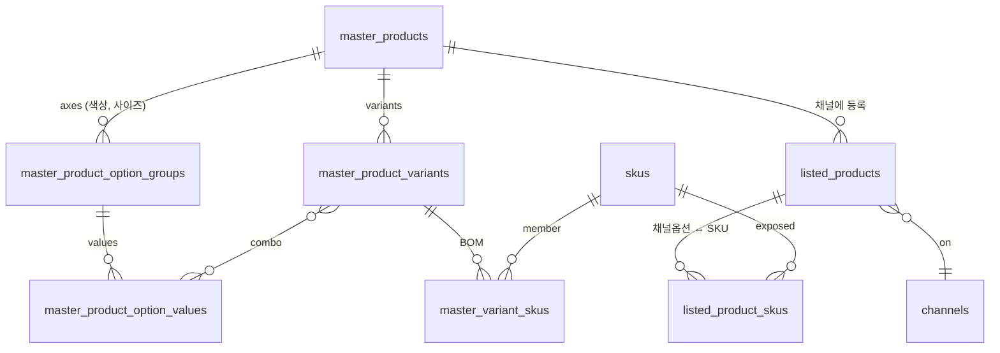
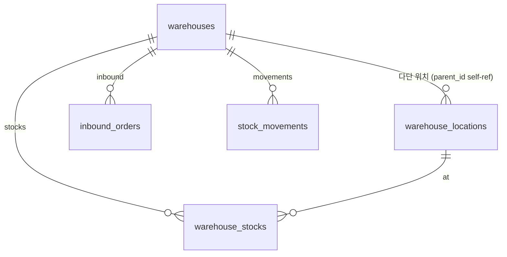

# DB 스키마 ER 다이어그램

`apps/server/src/db/schema.ts` 기준. PK는 `id`(uuid) 통일, FK는 화살표로 표현.

## 전체 ER 다이어그램

```mermaid
erDiagram
    users {
        uuid id PK
        text email UK
        text password_hash
        text name
        boolean is_active
        timestamp created_at
        timestamp updated_at
    }

    channels {
        uuid id PK
        uuid user_id FK
        enum channel_type "QOO10_JP|SHOPEE|RAKUTEN|SHOPIFY|CUSTOM"
        text name
        enum status "ACTIVE|INACTIVE|PENDING"
        text adapter_version
        jsonb mapping_schema
        timestamp created_at
        timestamp updated_at
    }

    channel_credentials {
        uuid id PK
        uuid channel_id FK
        enum credential_type "API_KEY|COOKIE|OAUTH"
        text encrypted_value "AES-256-GCM"
        timestamp expires_at
        timestamp created_at
        timestamp updated_at
    }

    orders {
        uuid id PK
        uuid user_id FK
        uuid channel_id FK
        text channel_order_id
        enum status "PENDING|PAID|PREPARING|SHIPPED|DELIVERED|CANCELLED|CLAIMED|RETURNED"
        timestamp ordered_at
        text buyer_name
        text buyer_kana
        text buyer_phone
        text buyer_email
        text receiver
        text shipping_address
        text zip_code
        text currency
        numeric total_amount
        numeric krw_amount
        text payment_method
        text carrier_id
        text tracking_number
        timestamp ship_date
        jsonb raw_data
        timestamp created_at
        timestamp updated_at
    }

    order_items {
        uuid id PK
        uuid order_id FK
        text product_name
        text option
        varchar sku
        integer quantity
        numeric unit_price
        numeric total_price
        timestamp created_at
        timestamp updated_at
    }

    products {
        uuid id PK
        uuid user_id FK
        uuid channel_id FK
        text channel_item_code
        text status
        text title
        numeric price
        numeric settle_price
        numeric retail_price
        integer qty
        text category_main_code
        text category_main_name
        text category_sub1_code
        text category_sub1_name
        text category_sub2_code
        text category_sub2_name
        jsonb raw_data
        timestamp created_at
        timestamp updated_at
    }

    master_products {
        uuid id PK
        uuid user_id FK
        varchar code "passoffer 내부 코드"
        varchar title
        jsonb attributes "qoo10.* / shopify.* 네임스페이스 키"
        timestamp created_at
        timestamp updated_at
    }

    master_product_variants {
        uuid id PK
        uuid master_product_id FK
        varchar sku
        numeric price
        integer stock "추후 폐기 예정 → skus.stock 단일 원천"
        jsonb extra_attributes
        timestamp created_at
        timestamp updated_at
    }

    master_product_option_groups {
        uuid id PK
        uuid master_product_id FK
        varchar name "예: 색상"
        integer position
        timestamp created_at
        timestamp updated_at
    }

    master_product_option_values {
        uuid id PK
        uuid group_id FK
        varchar value "예: 빨강"
        integer position
        timestamp created_at
        timestamp updated_at
    }

    master_product_variant_option_values {
        uuid variant_id PK,FK
        uuid option_value_id PK,FK
    }

    skus {
        uuid id PK
        uuid user_id FK
        varchar code UK "user_id + code 유니크"
        varchar name
        integer stock "재고 단일 원천"
        varchar barcode
        jsonb attributes
        varchar warehouse_text
        boolean is_primary_warehouse
        varchar vendor_text
        integer lead_time_days
        integer safety_stock
        varchar model_name
        varchar inventory_code
        text image
        varchar standard_code
        varchar hs_code
        varchar isbn
        boolean is_bundlable
        numeric width_cm
        numeric height_cm
        numeric depth_cm
        numeric weight_kg
        numeric inbound_unit
        varchar inbound_unit_type
        numeric purchase_cost
        numeric purchase_freight
        numeric delivery_fee
        numeric ad_cost
        numeric etc_cost
        numeric supply_price
        numeric sale_price
        varchar currency
        varchar origin_country
        jsonb origin_extras
        boolean requires_caution
        varchar tax_type "GENERAL|ZERO|EXEMPT"
        varchar brand
        varchar manufacturer
        varchar manufacturer_en
        varchar age_group
        jsonb info_notice
        text main_image
        text description_html
        timestamp created_at
        timestamp updated_at
    }

    master_variant_skus {
        uuid id PK
        uuid master_variant_id FK
        uuid sku_id FK
        integer qty "BOM 수량 (번들 지원)"
        integer position
        timestamp created_at
    }

    listed_products {
        uuid id PK
        uuid user_id FK
        uuid master_product_id FK
        uuid channel_id FK
        varchar channel_item_id "Qoo10 ItemCode 등"
        timestamp linked_at
        enum sync_status "PENDING|SYNCED|ERROR"
        text sync_error
        timestamp last_synced_at
        jsonb channel_data
        timestamp created_at
        timestamp updated_at
    }

    listed_product_variant_links {
        uuid id PK
        uuid listed_product_id FK
        uuid master_variant_id FK
        varchar channel_variant_id
        varchar channel_seller_code
        timestamp created_at
    }

    listed_product_skus {
        uuid id PK
        uuid listed_product_id FK
        uuid sku_id FK
        varchar channel_variant_id
        varchar channel_seller_code
        integer qty
        timestamp created_at
    }

    master_stock_ledger {
        uuid id PK
        uuid user_id FK
        uuid variant_id FK
        enum type "SALE|MANUAL_ADJUST|SYNC_RESET"
        integer qty_delta
        integer prev_stock
        integer new_stock
        enum ref_type "ORDER|USER|SYNC"
        varchar ref_id
        uuid channel_id FK
        uuid listed_product_id FK
        text note
        timestamp created_at
    }

    warehouses {
        uuid id PK
        uuid user_id FK
        varchar code
        varchar name
        enum vendor "self|cj_logistics|hanjin|sftp_batch|custom"
        varchar sync_mode
        enum status "ACTIVE|INACTIVE|PENDING"
        jsonb capabilities_json
        jsonb config_json
        timestamp last_sync_at
        timestamp created_at
        timestamp updated_at
    }

    warehouse_locations {
        uuid id PK
        uuid warehouse_id FK
        uuid parent_id "self-ref"
        varchar code
        varchar name
        integer level
        varchar full_path
        timestamp created_at
    }

    warehouse_stocks {
        uuid id PK
        uuid warehouse_id FK
        uuid master_product_id FK
        varchar master_variant_sku
        varchar vendor_sku
        uuid location_id FK
        varchar lot_code
        integer quantity
        integer reserved_quantity
        enum source_vendor
        timestamp fetched_at
        varchar freshness
        timestamp last_sync_at
        timestamp created_at
        timestamp updated_at
    }

    inbound_orders {
        uuid id PK
        uuid user_id FK
        uuid warehouse_id FK
        enum status "pending_dispatch|instructed|received|canceled"
        varchar vendor_ref
        timestamp expected_at
        jsonb items_json
        text note
        timestamp created_at
        timestamp updated_at
    }

    stock_movements {
        uuid id PK
        uuid user_id FK
        uuid warehouse_id FK
        enum type "inbound|outbound|transfer|adjustment"
        enum status "applied|pending_external|failed"
        varchar vendor_ref
        varchar reason_code
        jsonb payload_json
        timestamp created_at
    }

    claims {
        uuid id PK
        uuid user_id FK
        uuid channel_id FK
        text order_no
        text claim_status
        text reason
        timestamp request_date
        timestamp cancel_refund_date
        text buyer
        text buyer_mobile
        text receiver
        text receiver_mobile
        text tracking_no
        text delivery_company
        text tracking_no_return
        text delivery_company_return
        timestamp created_at
        timestamp updated_at
    }

    users ||--o{ channels : owns
    users ||--o{ orders : places
    users ||--o{ products : owns
    users ||--o{ master_products : owns
    users ||--o{ skus : owns
    users ||--o{ listed_products : owns
    users ||--o{ master_stock_ledger : owns
    users ||--o{ warehouses : owns
    users ||--o{ inbound_orders : owns
    users ||--o{ stock_movements : owns
    users ||--o{ claims : owns

    channels ||--o{ channel_credentials : has
    channels ||--o{ orders : receives
    channels ||--o{ products : lists
    channels ||--o{ listed_products : links
    channels ||--o{ claims : has
    channels ||--o{ master_stock_ledger : refs

    orders ||--o{ order_items : has

    master_products ||--o{ master_product_variants : has
    master_products ||--o{ master_product_option_groups : has
    master_products ||--o{ listed_products : linked_via
    master_products ||--o{ warehouse_stocks : tracked_in

    master_product_option_groups ||--o{ master_product_option_values : has
    master_product_variants ||--o{ master_product_variant_option_values : tagged
    master_product_option_values ||--o{ master_product_variant_option_values : assigned_to

    master_product_variants ||--o{ master_variant_skus : BOM
    skus ||--o{ master_variant_skus : composed_of
    master_product_variants ||--o{ master_stock_ledger : tracks

    listed_products ||--o{ listed_product_variant_links : maps
    master_product_variants ||--o{ listed_product_variant_links : maps_to_channel
    listed_products ||--o{ listed_product_skus : direct_maps
    skus ||--o{ listed_product_skus : exposed_as
    listed_products ||--o{ master_stock_ledger : sync_ref

    warehouses ||--o{ warehouse_locations : contains
    warehouses ||--o{ warehouse_stocks : holds
    warehouses ||--o{ inbound_orders : receives
    warehouses ||--o{ stock_movements : logs
    warehouse_locations ||--o{ warehouse_stocks : positions
```

## 핵심 도메인 모델 (요약)

### 상품 3계층

> **SKU 재구조화 포인트** (브랜치 `feat/sku-master-listed-restructure`)
> - 재고 단일 원천 = `skus.stock` (master_product_variants.stock 폐기 예정)
> - 동일 SKU가 여러 마스터/채널에 속할 수 있음 (공유 SKU + 번들)
> - `listed_product_skus` 가 `listed_product_variant_links`를 점진 대체

### 재고/WMS

### 변경 이력

`master_stock_ledger` 가 모든 재고 변동(SALE/MANUAL_ADJUST/SYNC_RESET)을 prev/new 스냅샷으로 기록.
`ref_type`/`ref_id` 로 변동 출처(주문/사용자/동기화) 역추적 가능.

## 갱신 방법

스키마를 수정한 뒤 이 문서도 같이 업데이트하세요. (자동화 도구는 아직 미도입 — `bun run db:studio` 로 라이브 비교 가능)
